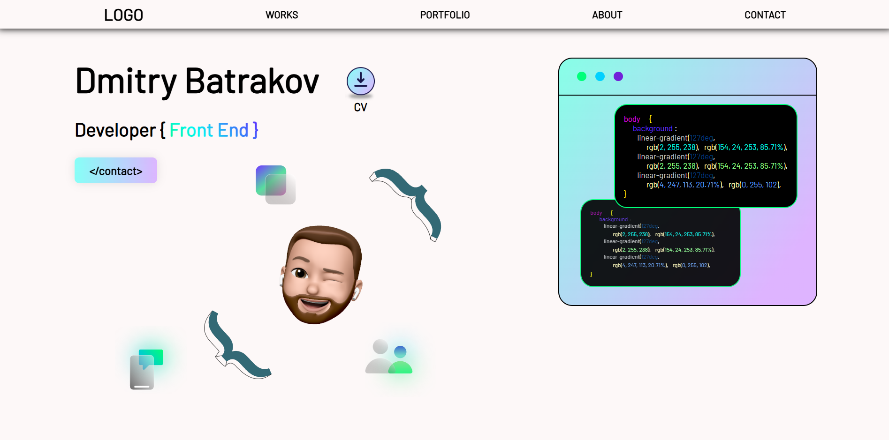
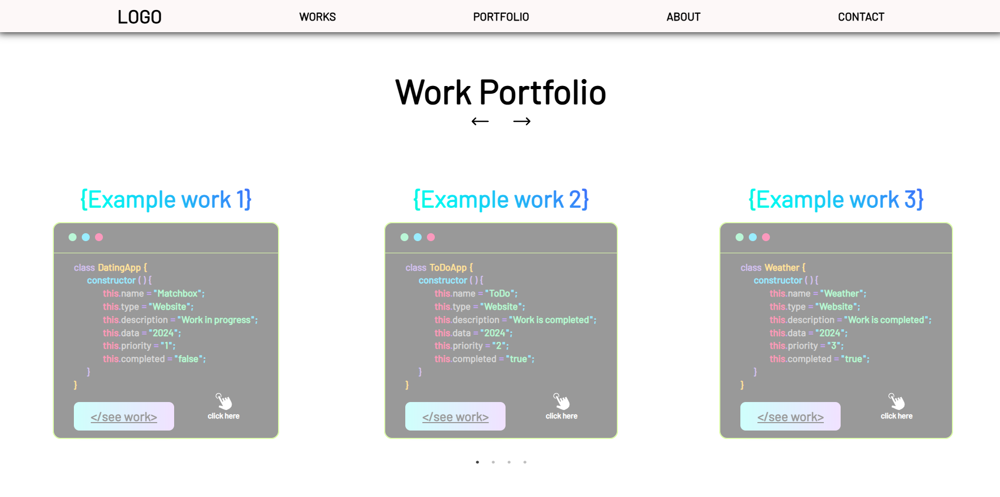
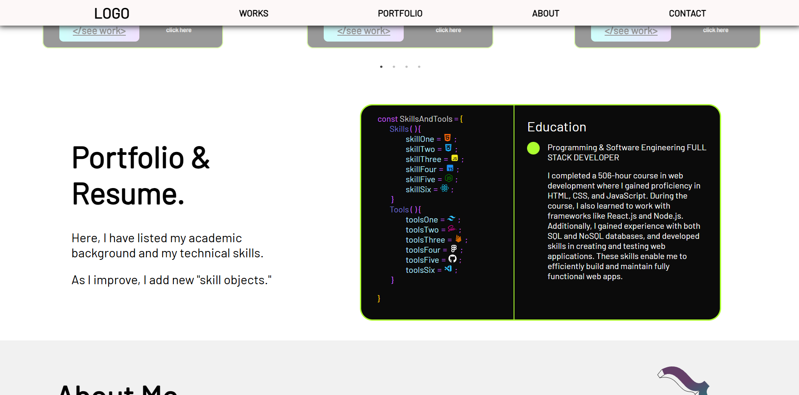
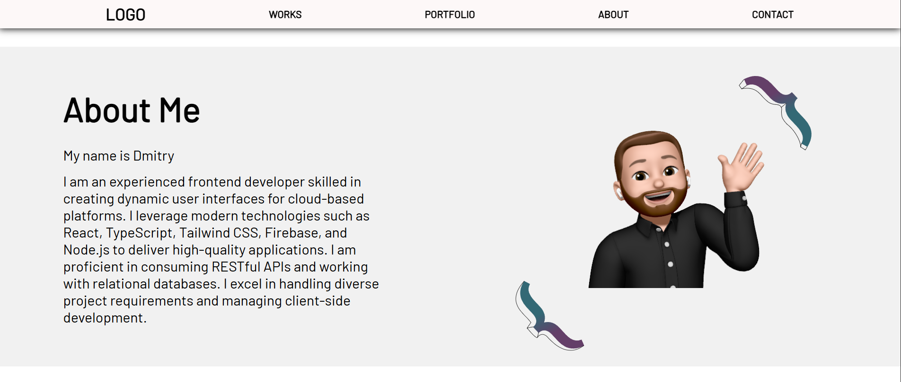
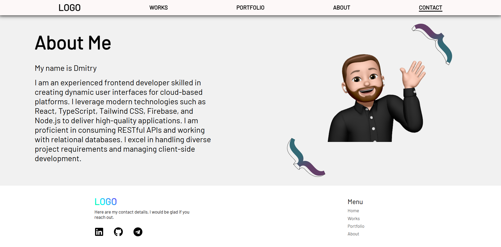

# Portfolio Website

This is my personal portfolio website showcasing selected projects, experience, and contact details.

## Live Demo

[Visit the site](https://portfolio-t03m.onrender.com)

## Tech Stack

- **React (JavaScript)**
- **SCSS**
- **Responsive layout**
- **Deployed on Render**

## Key Features

- Homepage with animated introduction and navigation
- Projects section with links to live demos and GitHub repos
- Skills & Technologies section
- About Me page
- Contact form with submission handling
- **Downloadable resume** directly from the site
- Fully responsive layout

## Screenshots

### Homepage

### Projects Section

### Portfolio Section

### About Section

### Contact Section

## Author

**Dmitriy Batrakov**  
[GitHub Profile](https://github.com/DmitryBatrakov)
